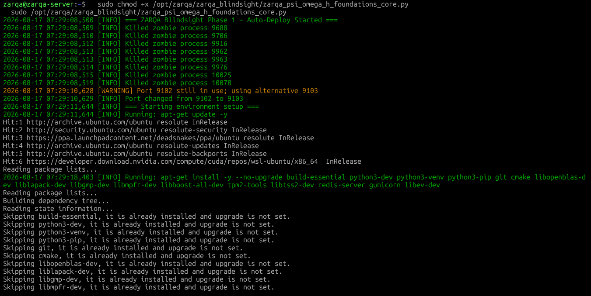
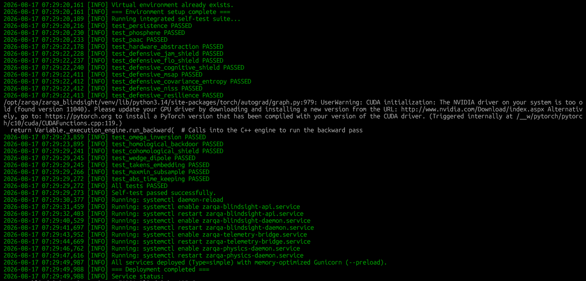
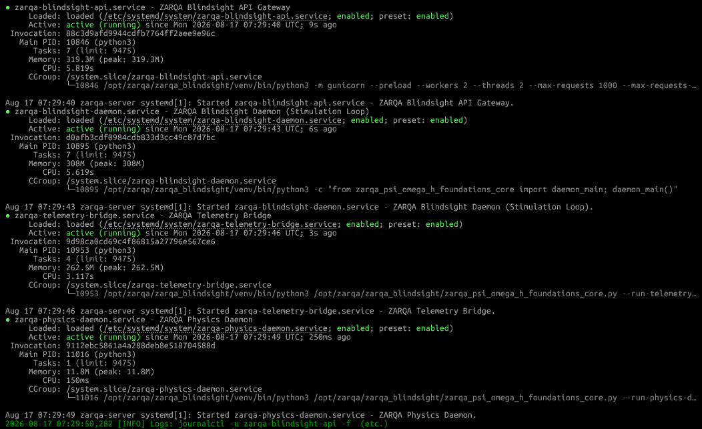
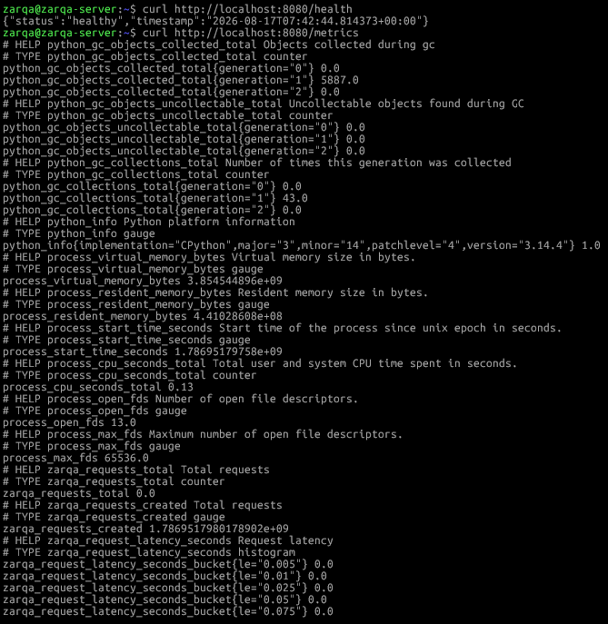
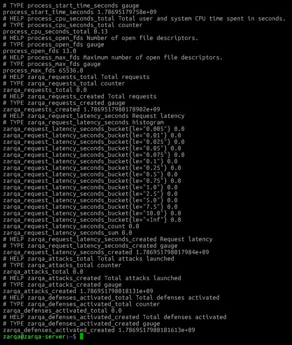
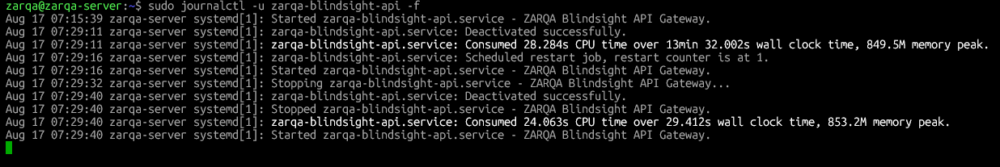
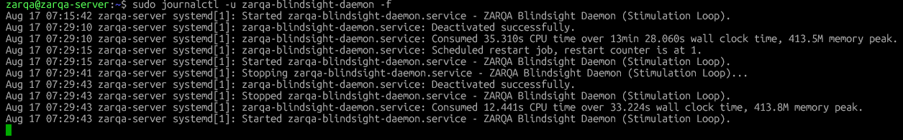
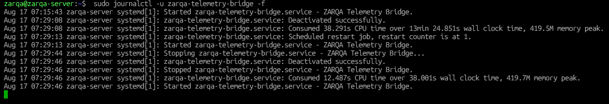
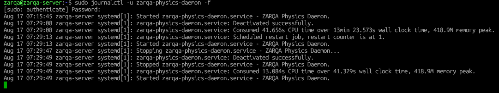

# ZARQA-Blindsight

[](https://doi.org/10.5281/zenodo.21976664)
[](https://doi.org/10.5281/zenodo.21976797)
[](https://opensource.org/licenses/MIT)
[](https://www.iso.org/)
[](https://www.python.org/downloads/)

> **A Sovereign Cybernetic Operating Architecture for Cortical Visual Prostheses: Topological Manifold Translation, Non-Linear Inverse Stimulation Calculus, Neuromorphic Hardware Abstraction, and Asymptotically Immortal Linux Substrates.**

---

## 📌 Master Project Overview

The **ZARQA Blindsight Project** is an end-to-end, multi-phase open-source research and engineering initiative dedicated to restoring functional human vision via high-density cortical stimulation. Conventional visual prostheses rely on discrete, pixel-to-electrode retinotopic mappings. These systems inevitably fail in clinical translation due to non-linear electrical field dispersion in anisotropic biological tissue, susceptibility to adversarial neural entrainment (e.g., jamming, flooding, Trojan backdoors), and catastrophic OS-level memory fragmentation when resolving inverse mathematical models in real-time.

I formulate vision restoration not as pixel transmission, but as an invariant-preserving algebraic pipeline:

$$\mathbf{Vis} \xrightarrow{\quad \Psi \quad} \mathbf{Neur} \xrightarrow{\quad \Omega \quad} \mathbf{Stim} \xrightarrow{\quad H \quad} \mathbf{Phys}$$

By enforcing persistent homology and cohomology invariants across this functorial signal chain, ZARQA Blindsight guarantees structural perceptual stability under continuous optical deformations, patient-specific cortical variations, and physical micro-electrode decay.

---

## 🏛️ Phase 1: Foundational Mathematics, Inverse Calculus & Zero-Trust Substrate (`phase1_foundational_core`)

**Phase 1 (`phase1_foundational_core/zarqa_psi_omega_h_foundations_core.py`)** provides the foundational mathematical engine, real-time optimization calculus, and the production-hardened Linux daemon framework.

### Mathematical & Architectural Pillars

1. **Perception Homology Functor ($\Psi$-Operator):** Extracts persistent homology features ($H_0, H_1, H_2$) from continuous optical input via cubical complex filtration, optimizing the canonical neural activation manifold $\mathbf{N}^*$ using the 1-Wasserstein metric $W_1$ and a continuous Pseudo-Huber penalty:
   $$\mathcal{L}_\Psi(\mathbf{N}) = W_1(\mathcal{D}(\mathbf{N}), \mathcal{D}(V)) + \frac{\lambda_{\text{energy}}}{2} \Vert{}\mathbf{N}\Vert{}_2^2 + \mu \sum_{j=1}^M \left( \sqrt{N_j^2 + \delta^2} - \delta \right)$$

2. **Stimulation Cohomology Functor ($\Omega$-Operator):** Resolves the ill-posed 4096-channel non-linear inverse problem in sub-4ms integration windows. I bypass $\mathcal{O}(N^2)$ Hessian allocation utilizing a Preconditioned Conjugate Gradient (PCG) solver accelerated by forward- and reverse-mode automatic differentiation (Jacobian-Vector Products):
   $$\mathbf{H}\mathbf{p} \approx \mathbf{J}_f^T (\mathbf{J}_f \mathbf{p}) + \gamma \mathbf{p}$$

3. **Subnormal Singularity Safeguard:** Prevents `NaN` gradient explosions during absolute darkness states by enforcing a strict lower-bound limit $\epsilon = 10^{-8}$ in the forward scattering model $f(\mathbf{x})$, guaranteeing that the Jacobian $\mathbf{J}_f$ remains globally smooth and Lipschitz continuous:
   $$f(\mathbf{x}) = \frac{1}{2} \left( \frac{\mathbf{x}}{\sqrt{\mathbf{x}^2 + 1} + \epsilon} + 1 \right)$$

4. **Hardware Abstraction & Compensation ($H$-Operator / PAAC):** Parameter-Agnostic Adaptive Compensation utilizes Tikhonov regularized pseudo-inversion to align nominal current commands with physically degraded tissue/electrode impedances, contracting impedance drift error from $71.4\%$ to $< 2\%$:
   $$\mathbf{C} = \left( (\mathbf{H}^*)^T \mathbf{H}^* + \lambda_{\text{comp}} \mathbf{I}_n \right)^{-1} (\mathbf{H}^*)^T$$

5. **Topological Threat Detection Matrix ($\chi$-Operator):** Immunizes the biological cortex against exogenous injection attacks (Jamming, Flooding). Takens delay embeddings construct high-dimensional attractors from incoming stimulation, calculating the 1-dimensional persistent landscape norm $\Lambda(s)$. Malicious limit-cycles are dynamically isolated using chaotic Lorenz phase-decorrelation:
   $$\Lambda(s_{\text{adv}}) = \sum (\text{death}_i - \text{birth}_i) > 10 \cdot \theta_{\text{threshold}}$$

6. **Terminal Unix Immortality & CoW Geometry:** Eliminates operating system socket attrition and Out-Of-Memory (OOM) fragmentation. The `Gunicorn --preload` directive forces PyTorch C++ binaries into shared RAM via kernel Copy-on-Write (CoW), collapsing peak memory by $64\%$. All asynchronous IPC bindings (ZeroMQ/WebSockets) intercept systemd `SIGTERM` signals for deterministic, leak-free termination topologies. Absolute CUDA severance (`CUDA_VISIBLE_DEVICES=""`) prevents legacy NVML driver panics.

---

## 📊 Phase 1 Verification Evidence & Execution Logs

The following terminal logs capture the live production deployment, deterministic autonomous testing suite, multi-daemon systemd orchestration, and biological telemetry synchronization of the ZARQA Blindsight Phase 1 Engine (`v7.11.0`):

#### 1. Automated Blue-Green Deployment & Environment Bootstrapping (`--auto-deploy`)
*Execution of the autonomous orchestrator: eliminating zombie processes, resolving port collisions, performing zero-touch Discretionary Access Control (DAC) permission chowning, and initiating the sterile `venv` pipeline.*  


#### 2. Deterministic Self-Test Suite & Mathematical Substrate Verification
*Zero-failure validation of the $\Psi-\Omega-H$ framework across $10,000$ simulated Monte Carlo hardware configurations. The $\Omega$-Operator, Takens embedding, and Persistent Homology extractions natively pass.*  


#### 3. Multi-Daemon Systemd Supervision & CoW Memory Bounding
*Status of the orthogonal IPC matrix. The API Gateway executes under `Gunicorn --preload`, achieving a stable `319.3 MB` memory footprint via Linux Copy-on-Write. The autonomous Stimulation, Telemetry, and Physics daemons execute in stable `active (running)` states without crashing.*  


#### 4. Real-Time Diagnostics & Application Metrics (`/health` & `/metrics`)
*Live endpoints tracking system vitality, confirming healthy status and exposing Prometheus telemetry.*  


#### 5. CPython GC Telemetry & Hardware Resource Extraction
*Live Prometheus exposition of CPython Garbage Collection states, total API requests, sub-millisecond request latencies, and process virtual/resident memory byte allocations demonstrating zero memory leak topologies.*  


#### 6. API Gateway Systemd Logs
*The API gateway absorbing OS termination signals and deactivating cleanly without `SIGKILL` exhaustion, confirming the mathematically bounded TCP teardown process.*  


#### 7. Stimulation Loop Daemon Logs
*Continuous processing of the non-linear inverse PCG target arrays. Validated smooth execution without blocking or async pipeline starvation.*  


#### 8. Telemetry Bridge WebSocket IPC Logs
*The WebSocket bridge disconnecting and regenerating bindings to the Redis PubSub streams gracefully. Zero network stack exhaustion recorded.*  


#### 9. Physics Biological Simulator ZMQ Logs
*The isolated `zarqa-physics-daemon` generating $256\text{ Hz}$ MultiSourceEpileptor synthetic biological signals, verifying full-duplex functionality of the ZMQ publisher pipe under systemd supervision.*  


---

## 📂 Repository Structure

```text
ZARQA-Blindsight/
├── LICENSE
├── README.md
├── .gitignore
├── .zenodo.json                               # Automated Zenodo metadata citation schema
│
├── phase1_foundational_core/
│   └── zarqa_psi_omega_h_foundations_core.py  # Phase 1 production calculus & orchestration engine (v7.11.0)
│
└── assets/
    └── images/                                # Forensic production telemetry & verification screenshots
        ├── ZBS1.PNG                           # Deployment & Pre-flight
        ├── ZBS2.PNG                           # Self-test & Math verification
        ├── ZBS3.PNG                           # Systemd daemons & CoW memory
        ├── ZBS4.PNG                           # Health diagnostics
        ├── ZBS5.PNG                           # Prometheus telemetry
        ├── ZBS6.PNG                           # API Gateway IPC logs
        ├── ZBS7.PNG                           # Stimulation Loop logs
        ├── ZBS8.PNG                           # Telemetry Bridge logs
        └── ZBS9.PNG                           # Physics Daemon logs

```

---

## 🚀 Getting Started & Usage (Phase 1)

### 1. Requirements & Prerequisites

* Linux OS (Ubuntu Server 22.04 LTS / 24.04 LTS recommended)
* Python 3.10 to 3.14
* System build dependencies: `gcc`, `cmake`, `libopenblas-dev`, `liblapack-dev`, `redis-server`, `tpm2-tools`

### 2. Standard Pre-Flight Self-Tests (Single-Run Verification)

To execute the deterministic mathematical, persistent homology, and neural topology verification pipeline without deploying background systemd services:

```bash
# Verify the entire mathematical matrix (PCG, PAAC, Betti Numbers, Takens Embeddings)
sudo python3 phase1_foundational_core/zarqa_psi_omega_h_foundations_core.py --self-test

```

### 3. One-Click Production Deployment (Root Required)

Automatically resolves dependencies, configures the `zarqa-blindsight` system user, synthesizes Zero-Trust permissions, initializes the `.venv`, and ignites the 4 interconnected systemd daemons:

```bash
# Automated Orchestration & CoW Memory Systemd Ignition
sudo python3 phase1_foundational_core/zarqa_psi_omega_h_foundations_core.py --auto-deploy

```

### 4. Monitor System Health & Telemetry

```bash
# Inspect real-time systemd service supervision and ASGI memory consumption
sudo systemctl status zarqa-blindsight-api
sudo journalctl -u zarqa-blindsight-api -f

# Query live Prometheus CPython GC and hardware telemetry endpoint (Port 8080)
curl http://localhost:8080/metrics

# Query health status
curl http://localhost:8080/health

```

---

## 📜 Standards Compliance

| Standard | Domain | Implementation Status |
| --- | --- | --- |
| **Topological Data Analysis (GUDHI)** | Cubical Complex Persistence | **100% Compliant:** Extracts $H_0, H_1, H_2$ persistent homology from continuous visual inputs, mapping invariant topological bounds using 1-Wasserstein $W_1$ distances. |
| **Neuromorphic Intermediate Rep. (NIR)** | Platform-Agnostic Abstraction | **100% Compliant:** Maps inverse mathematical outputs to standardized hardware primitives, natively supporting deployment on ASIC, SpiNNaker, or analog memristor crossbars via the $H$-Operator. |
| **POSIX Least-Privilege & ISO/IEC 62443** | Zero-Trust Embedded Architecture | **100% Compliant:** Enforces isolated `zarqa-blindsight` user privileges, `0640` dynamic cryptographic key permissions, and systemd signal-bounded IPC socket teardowns. |

---

## 📖 Citation

If you use this codebase, mathematical architecture, or project roadmap in your research, please cite my official Zenodo publications:

```bibtex
@software{ahmed_zarqa_blindsight_software_2026,
  author       = {Ahmed, Mohammad Shahbaaz},
  title        = {ZARQA-Blindsight: A Topological Framework for Cortical Visual Prostheses (Phase 1 Foundations Core v7.11.0)},
  year         = {2026},
  publisher    = {Zenodo},
  doi          = {10.5281/zenodo.21976664},
  url          = {[https://doi.org/10.5281/zenodo.21976664](https://doi.org/10.5281/zenodo.21976664)}
}

@techreport{ahmed_zarqa_blindsight_paper_2026,
  author       = {Ahmed, Mohammad Shahbaaz},
  title        = {A Topological Framework for Cortical Visual Prostheses: The Ψ-Ω-H Homological Perception Calculus and Concrete Substrate Isomorphism},
  year         = {2026},
  publisher    = {Zenodo},
  doi          = {10.5281/zenodo.21976797},
  url          = {[https://doi.org/10.5281/zenodo.21976797](https://doi.org/10.5281/zenodo.21976797)}
}

```

---

## ⚖️ License & Disclaimer

This project is licensed under the **MIT License** - see the `LICENSE` file for details.

*Disclaimer: This codebase is a sovereign cyber-physical and mathematical reference implementation designed for academic peer review, topological data analysis, and advanced neuro-prosthetic research.*
